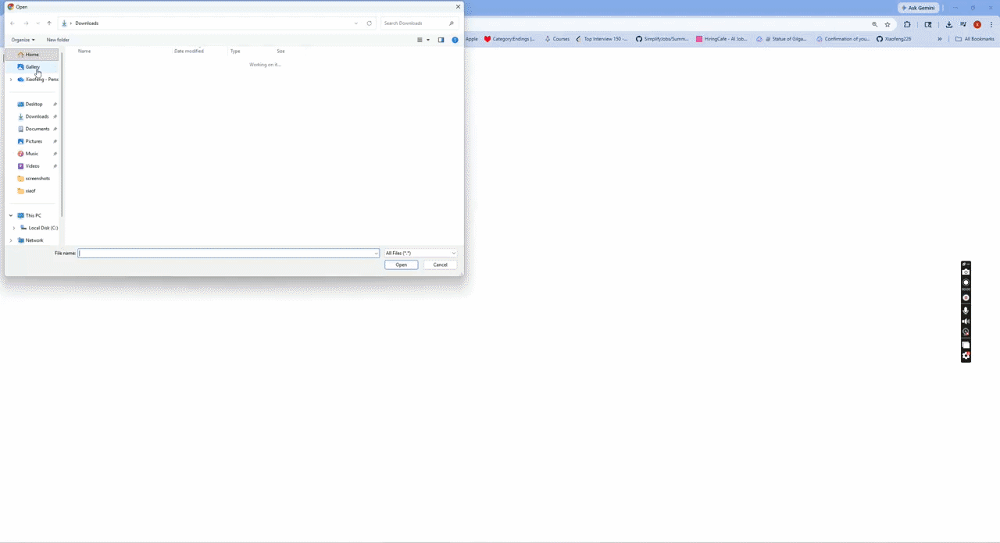

# Flask on Docker 

## Overview

This repository demonstrates how to containerize a Flask web application with PostgreSQL for data persistence, Gunicorn as a production-grade WSGI server, and Nginx as a reverse proxy. The project is fully Dockerized using Docker Compose, with separate configurations for development and production environments. It supports static and user-uploaded media file handling via Nginx, and uses Flask-SQLAlchemy for database modeling. This is a practical, portfolio-ready example of a production-style Python web service deployment. 

Most of these files are made through the instructions: https://testdriven.io/blog/dockerizing-flask-with-postgres-gunicorn-and-nginx/
But note that I


## Demo



## Build Instructions


### Prerequisites

- [Docker](https://docs.docker.com/get-docker/)
- [Docker Compose](https://docs.docker.com/compose/install/)
- '.env.prod.db' file and other .env files. '.env.prod.db' is excluded from security sakes!

### Environment Configuration

- For security reasons, we hide the production credentials that are hidden within the '.env.prod.db', as that is the oly file that has the production credentials. So we must include a '.env.prod.db' which includes the 'POSTGRES_USER', 'POSTGRES_PASSWORD' and 'POSTGRES_DB'

### Development

**1. Clone the repo:**
```bash
git clone https://github.com//flask-on-docker.git
cd flask-on-docker
```

**2. Build and start the containers:**
```bash
docker-compose up -d --build
```


**3. Create the database tables:**
```bash
docker-compose exec web python manage.py create_db
```


**4. Visit the app:**
- API: [http://localhost:1234/](http://localhost:1234/)
- Upload a file: [http://localhost:1234/upload](http://localhost:1234/upload)
- View uploaded file: [http://localhost:1234/media/IMAGE_FILE_NAME](http://localhost:1234/media/IMAGE_FILE_NAME)


### Production

**1. Build and start the production containers:**
```bash
docker-compose -f docker-compose.prod.yml up -d --build
```

**2. Create the database tables:**
```bash
docker-compose -f docker-compose.prod.yml exec web python manage.py create_db
```

**3. Visit the app:**
- API: [http://localhost:5678/](http://localhost:5678/)
- Static file: [http://localhost:5678/static/hello.txt](http://localhost:5678/static/hello.txt)
- Upload a file: [http://localhost:5678/upload](http://localhost:5678/upload)
- View uploaded file: [http://localhost:5678/media/IMAGE_FILE_NAME](http://localhost:5678/media/IMAGE_FILE_NAME)


**4. Stop the containers:**
```bash
docker-compose -f docker-compose.prod.yml down -v
```


